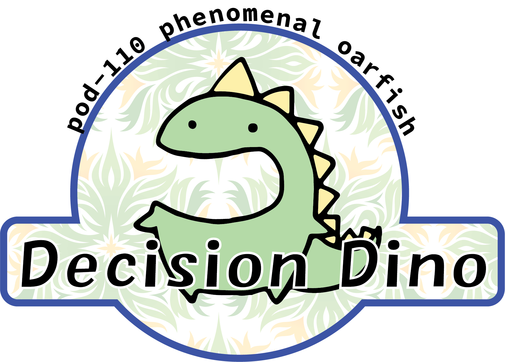

# NMA 2020 Decision-Dino
## pod-110 phenomenal oarfish

### References
* [NeuroMatch Academy projects page](https://github.com/NeuromatchAcademy/course-content/tree/master/projects)
* [load_steinmetz_extra.ipynb](https://github.com/NeuromatchAcademy/course-content/blob/master/projects/load_steinmetz_extra.ipynb)
* [load_steinmetz_decisions.ipynb](https://github.com/NeuromatchAcademy/course-content/blob/master/projects/load_steinmetz_decisions.ipynb)

* [WaveMetrics.com smoothing algorithm intro](https://www.wavemetrics.com/products/igorpro/dataanalysis/signalprocessing/smoothing)
